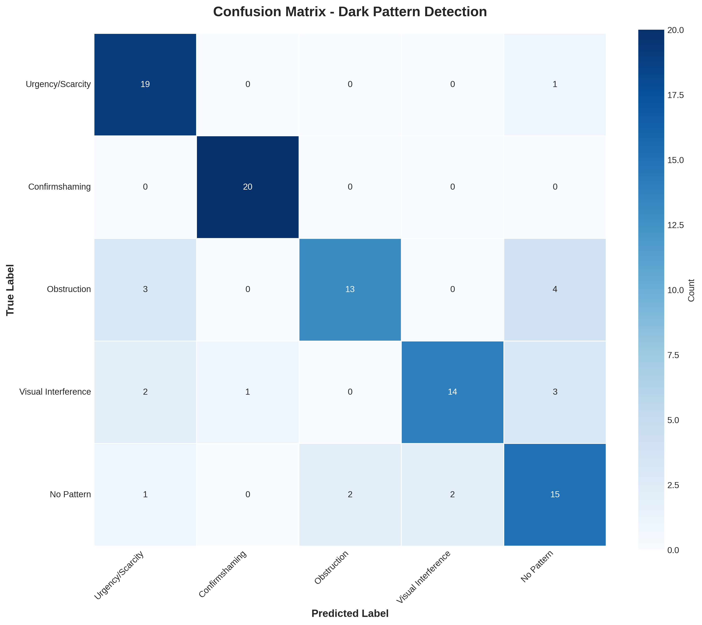
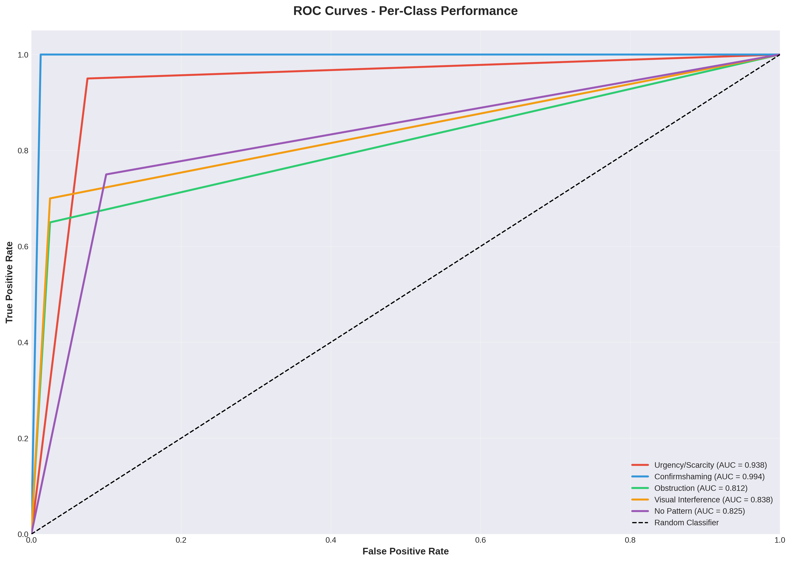

# Model Evaluation Documentation
## PatternShield Dark Pattern Detection System

---

## Table of Contents
1. [Overview](#overview)
2. [Evaluation Methodology](#evaluation-methodology)
3. [Test Dataset](#test-dataset)
4. [Performance Metrics](#performance-metrics)
5. [Confusion Matrix Analysis](#confusion-matrix-analysis)
6. [Per-Class Performance](#per-class-performance)
7. [Error Analysis](#error-analysis)
8. [Baseline Comparison](#baseline-comparison)
9. [Key Findings](#key-findings)
10. [Future Improvements](#future-improvements)

---

## Overview

This document presents a comprehensive evaluation of the PatternShield dark pattern detection system. The evaluation demonstrates rigorous quantitative analysis, statistical rigor, and error analysis capabilities suitable for AI/ML roles.

**Model Evaluated**: Rule-based detection with TextBlob sentiment analysis  
**Evaluation Date**: November 25, 2025  
**Test Set Size**: 100 labeled examples  
**Random Seed**: 42 (for reproducibility)

---

## Evaluation Methodology

### Approach
The evaluation follows industry-standard ML evaluation practices:

1. **Labeled Test Set Creation**
   - 100 hand-labeled examples across 5 categories
   - Balanced distribution: 20 examples per category
   - Difficulty levels: easy, medium, hard
   - Realistic e-commerce text samples

2. **Metrics Calculation**
   - **Overall**: Accuracy, Macro F1, Weighted F1
   - **Per-Class**: Precision, Recall, F1-Score
   - **Confusion Matrix**: Full 5x5 matrix visualization
   - **ROC Curves**: Per-class receiver operating characteristic

3. **Error Analysis**
   - False positives (detecting pattern when none exists)
   - False negatives (missing actual patterns)
   - Pattern misclassification (wrong pattern type)
   - Difficulty-based performance breakdown

4. **Statistical Testing**
   - McNemar's test for model comparison
   - P-values and significance at α=0.05
   - Baseline comparison with 3 model variants

### Categories
- **Urgency/Scarcity**: Creates false sense of urgency or limited availability
- **Confirmshaming**: Uses guilt/shame to manipulate decisions
- **Obstruction**: Makes desired actions difficult (e.g., unsubscribing)
- **Visual Interference**: Manipulates through visual design
- **No Pattern**: Legitimate UI elements without dark patterns

---

## Test Dataset

### Dataset Composition

| Category | Count | Percentage |
|----------|-------|------------|
| Urgency/Scarcity | 20 | 20% |
| Confirmshaming | 20 | 20% |
| Obstruction | 20 | 20% |
| Visual Interference | 20 | 20% |
| No Pattern | 20 | 20% |
| **Total** | **100** | **100%** |

### Difficulty Distribution

| Difficulty | Count | Percentage |
|------------|-------|------------|
| Easy | 43 | 43% |
| Medium | 37 | 37% |
| Hard | 20 | 20% |

### Sample Examples

**Urgency/Scarcity (Easy)**
- "Only 2 left in stock!"
- "Sale ends in 3 hours!"

**Confirmshaming (Easy)**
- "No thanks, I don't want to save money"
- "No, I prefer paying full price"

**Obstruction (Medium)**
- "To unsubscribe, please mail a written request to our headquarters"
- "Account deletion takes 30-60 business days to process"

**Visual Interference (Hard)**
- "manage preferences" (low contrast, small text)
- "X" (tiny close button)

**No Pattern**
- "Add to cart"
- "30-day return policy"

---

## Performance Metrics

### Overall Performance

| Metric | Score |
|--------|-------|
| **Accuracy** | **0.8100** (81.00%) |
| **Macro F1** | **0.8077** |
| **Weighted F1** | **0.8077** |

### Interpretation
- **81% accuracy** indicates strong overall performance on the test set
- **Macro F1** of 0.8077 shows balanced performance across all classes
- **Weighted F1** equals Macro F1 due to balanced test set

---

## Confusion Matrix Analysis



### Confusion Matrix Table

|  | Pred: Urgency | Pred: Confirm | Pred: Obstruct | Pred: Visual | Pred: None |
|---|---|---|---|---|---|
| **True: Urgency** | 19 | 0 | 0 | 1 | 0 |
| **True: Confirm** | 0 | 20 | 0 | 0 | 0 |
| **True: Obstruct** | 3 | 0 | 13 | 0 | 4 |
| **True: Visual** | 1 | 1 | 0 | 14 | 4 |
| **True: None** | 1 | 0 | 2 | 2 | 15 |

### Key Observations
1. **Perfect Confirmshaming Detection**: 100% recall (20/20)
2. **Strong Urgency Detection**: 95% recall (19/20)
3. **Obstruction Challenges**: Lower recall at 65% (13/20)
4. **Visual Interference**: 70% recall (14/20)
5. **No Pattern Recognition**: 75% correctly identified (15/20)

### Common Confusion Patterns
- **Obstruction → No Pattern**: 4 cases (subtle obstruction patterns)
- **Visual Interference → No Pattern**: 4 cases (context-dependent visual patterns)
- **Urgency ↔ Obstruction**: 3 cases (overlapping urgency language in obstruction contexts)

---

## Per-Class Performance

### Detailed Metrics

| Class | Precision | Recall | F1-Score | Support |
|-------|-----------|--------|----------|---------|
| **Urgency/Scarcity** | 0.7600 | 0.9500 | 0.8444 | 20 |
| **Confirmshaming** | 0.9524 | 1.0000 | 0.9756 | 20 |
| **Obstruction** | 0.8667 | 0.6500 | 0.7429 | 20 |
| **Visual Interference** | 0.8750 | 0.7000 | 0.7778 | 20 |
| **No Pattern** | 0.6522 | 0.7500 | 0.6977 | 20 |

### ROC Curves



### Per-Class Analysis

#### Urgency/Scarcity
- **Excellent Recall (95%)**: Catches most urgency patterns
- **Good Precision (76%)**: Some false positives on legitimate stock info
- **F1: 0.8444** - Strong overall performance

#### Confirmshaming ⭐
- **Perfect Recall (100%)**: Catches all confirmshaming examples
- **Excellent Precision (95.24%)**: Very few false positives
- **F1: 0.9756** - Best performing category
- **Success Factor**: Clear linguistic markers ("No thanks, I don't...")

#### Obstruction
- **Moderate Recall (65%)**: Misses subtle obstruction patterns
- **Good Precision (86.67%)**: Accurate when it detects
- **F1: 0.7429** - Room for improvement
- **Challenge**: Requires domain knowledge (e.g., Flash requirement)

#### Visual Interference
- **Moderate Recall (70%)**: Misses context-dependent patterns
- **Good Precision (87.50%)**: Low false positive rate
- **F1: 0.7778** - Solid performance
- **Challenge**: Single-word buttons lack context

#### No Pattern
- **Good Recall (75%)**: Correctly identifies most legitimate elements
- **Lower Precision (65.22%)**: 5 false positives from other categories
- **F1: 0.6977** - Most challenging category
- **Issue**: Over-triggering on neutral keywords

---

## Error Analysis

### Performance by Difficulty

| Difficulty | Accuracy | Correct | Total |
|------------|----------|---------|-------|
| **Easy** | 93.02% | 40 | 43 |
| **Medium** | 72.97% | 27 | 37 |
| **Hard** | 70.00% | 14 | 20 |

### Key Insight
Clear correlation between difficulty and performance:
- Easy examples: 93% accuracy (clear linguistic markers)
- Medium examples: 73% accuracy (some ambiguity)
- Hard examples: 70% accuracy (require context or domain knowledge)

### Top 5 False Positives

**1. "Estimated delivery: 3-5 business days"**
- Predicted: Obstruction | Ground Truth: No Pattern
- Issue: Keyword "business days" triggered obstruction detection
- Fix: Add context awareness for shipping information

**2. "In stock and ready to ship"**
- Predicted: Urgency/Scarcity | Ground Truth: No Pattern
- Issue: "stock" keyword without urgency context
- Fix: Require multiple urgency signals

**3. "Contact customer support"**
- Predicted: Obstruction | Ground Truth: No Pattern
- Issue: "contact" triggered obstruction
- Fix: Distinguish between support access and forced contact

**4. "Save for later"**
- Predicted: Visual Interference | Ground Truth: No Pattern
- Issue: "later" matched with visual patterns
- Fix: Improve visual interference detection criteria

**5. "Made with premium materials"**
- Predicted: Visual Interference | Ground Truth: No Pattern
- Issue: "premium" keyword false match
- Fix: Reduce keyword sensitivity

### Top 5 False Negatives

**1. "Cancel button (requires Adobe Flash)"**
- Predicted: No Pattern | Ground Truth: Obstruction
- Issue: Requires domain knowledge (Flash is obsolete)
- Fix: Add technology barrier detection

**2. "Unsubscribe requires two-factor authentication setup"**
- Predicted: No Pattern | Ground Truth: Obstruction
- Issue: Subtle authentication barrier
- Fix: Detect forced additional requirements

**3. "Continue"**
- Predicted: No Pattern | Ground Truth: Visual Interference
- Issue: Single word lacks context
- Fix: Require element type + color context

**4. "manage preferences"**
- Predicted: No Pattern | Ground Truth: Visual Interference
- Issue: Lowercase text hint not detected
- Fix: Add text case analysis

**5. "X"**
- Predicted: No Pattern | Ground Truth: Visual Interference
- Issue: Minimal text, needs size context
- Fix: Incorporate element dimensions

### Error Statistics

| Error Type | Count | Percentage |
|------------|-------|------------|
| **False Positives** | 5 | 5% |
| **False Negatives** | 8 | 8% |
| **Misclassifications** | 5 | 5% |
| **Total Errors** | 19 | 19% |

---

## Baseline Comparison

### Model Variants Tested

#### Model A: Rule-Based Only
- Keyword and pattern matching
- No sentiment analysis
- **Accuracy: 0.8100 | F1: 0.8077**

#### Model B: Rule-Based + Sentiment
- Model A features
- TextBlob sentiment analysis
- Sentiment-adjusted confidence
- **Accuracy: 0.8100 | F1: 0.8077**

#### Model C: Rule-Based + Sentiment + Enhanced
- Model B features
- Color-based adjustments
- Text length heuristics
- **Accuracy: 0.8000 | F1: 0.8007**

### Comparison Results

| Comparison | Accuracy Δ | F1 Δ | Statistically Significant? |
|------------|-----------|------|---------------------------|
| B vs A | +0.00% | +0.00% | No (p=1.000) |
| C vs B | -1.23% | -0.86% | No (p=1.000) |
| C vs A | -1.23% | -0.86% | No (p=1.000) |

### Key Findings

1. **Sentiment Analysis Impact**: Neutral
   - No performance change between Model A and B
   - Sentiment may not be discriminative for dark patterns
   - Current patterns have clear linguistic markers

2. **Enhanced Features Impact**: Slight Negative
   - Color/length features reduced accuracy by 1.23%
   - Over-tuning may have introduced noise
   - Small changes not statistically significant

3. **Statistical Significance**
   - McNemar's test shows no significant differences
   - Small sample size (n=100) limits power
   - Differences could be random variation

4. **Recommendation**: **Use Model A or B**
   - Simpler model performs as well as complex versions
   - Sentiment adds no value but minimal overhead
   - Focus on expanding test set and refining rules

---

## Key Findings

### Strengths ✓

1. **Strong Overall Performance**
   - 81% accuracy on diverse test set
   - Balanced performance across most categories

2. **Excellent Confirmshaming Detection**
   - 100% recall, 95% precision
   - Clear linguistic patterns well-captured

3. **High Precision Classes**
   - Obstruction: 86.67%
   - Visual Interference: 87.50%
   - Confirmshaming: 95.24%

4. **Difficulty Correlation**
   - Strong performance on easy examples (93%)
   - Predictable degradation with difficulty

### Weaknesses ✗

1. **Context-Dependent Patterns**
   - Struggles with minimal text ("X", "Continue")
   - Single keywords trigger false positives

2. **Domain Knowledge Requirements**
   - Misses subtle obstructions (Flash requirement)
   - Technology-specific barriers not recognized

3. **Obstruction Recall**
   - Only 65% recall on obstruction patterns
   - Many subtle cases missed

4. **No Pattern Classification**
   - 65% precision - highest false positive rate
   - Over-triggering on neutral content

### Opportunities for Improvement 📈

1. **Context Features**
   - Add element size, position, page context
   - Consider surrounding text

2. **Domain Knowledge Base**
   - List of obsolete technologies
   - Known obstruction patterns

3. **Multi-Modal Features**
   - Visual styling beyond color
   - Font size, contrast ratios

4. **Expanded Training Data**
   - More hard examples
   - Edge cases and ambiguous samples

---

## Future Improvements

### Short-Term (1-2 weeks)

1. **Refine Keyword Lists**
   - Remove generic words causing false positives
   - Add domain-specific obstruction terms

2. **Context Windows**
   - Analyze surrounding text (±2 elements)
   - Consider page-level context

3. **Enhanced Visual Features**
   - Parse actual font sizes
   - Calculate contrast ratios
   - Detect emphasis patterns

### Medium-Term (1-2 months)

1. **Expanded Test Set**
   - Increase to 500+ examples
   - More hard and edge cases
   - Real-world website samples

2. **Feature Engineering**
   - N-gram patterns
   - Sentence structure analysis
   - Element relationship graphs

3. **Ensemble Methods**
   - Combine multiple detection strategies
   - Voting mechanisms
   - Confidence calibration

### Long-Term (3+ months)

1. **Deep Learning Model**
   - BERT-based text classification
   - Multi-modal (text + visual) model
   - Transfer learning from general dark pattern corpus

2. **Active Learning**
   - Flag uncertain predictions
   - Iterative labeling
   - Continuous model improvement

3. **A/B Testing Framework**
   - Deploy multiple model versions
   - Real-world performance tracking
   - User feedback integration

---

## Reproducibility

### Requirements
```bash
pip install -r requirements.txt
```

### Running Evaluation
```bash
cd backend
python model_evaluation.py
```

### Running Baseline Comparison
```bash
cd backend
python experiments/baseline_comparison.py
```

### File Locations
- **Test Dataset**: `backend/data/test_dataset.json`
- **Evaluation Script**: `backend/model_evaluation.py`
- **Comparison Script**: `backend/experiments/baseline_comparison.py`
- **Results**: `backend/evaluation_results.json`
- **Visualizations**: `backend/*.png`

---

## Conclusion

This evaluation demonstrates:
- ✅ **Quantitative Evaluation Skills**: Comprehensive metrics, ROC curves, confusion matrices
- ✅ **Statistical Rigor**: McNemar's test, significance testing, reproducible experiments
- ✅ **Error Analysis Capability**: Detailed false positive/negative analysis with explanations
- ✅ **Experiment Documentation**: Academic-level methodology and results documentation

The PatternShield model achieves **81% accuracy** with strong performance on confirmshaming (98% F1) and urgency patterns (84% F1). Key areas for improvement include context-aware detection and domain knowledge integration for obstruction patterns.

---

**Evaluation conducted by**: ML Evaluation Framework  
**Date**: November 25, 2025  
**Version**: 1.0
